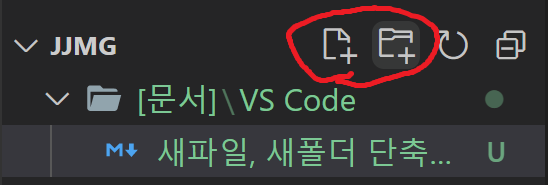

# 마우스로 얘네 클릭하지 않고, 새 파일, 새 폴더 만드는 법

https://honeyinfo7.tistory.com/m/310

1. Ctrl + Shift + P

2. Open Keyboard shortcut(JSON)

3. 아래와  코드 입력

   ```json
   [
     { "key": "ctrl+n",
       "command": "explorer.newFile",
       "when": "!editorFocus" },
   
   
     { "key": "ctrl+shift+n",
       "command": "explorer.newFolder",
       "when": "!editorFocus" }
   ]
   ```

# Ctrl + N : 새 파일

# Ctrl + Shift + N : 새 폴더

